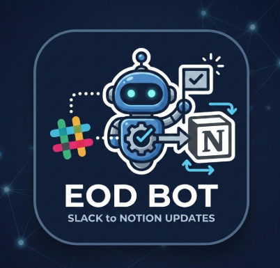

<p align="center">
  
</p>

# Slack → Notion EOD Sync Bot

Scheduled Node.js bot that scans Slack channels for End-of-Day (EOD) reports, includes thread replies, and syncs them into a Notion database. Runs as a GitHub Action on a cron schedule.

## Features

- Detects EOD reports by keyword and structure heuristics
- Fetches full threads (root + all replies)
- Upserts into Notion — creates new pages or updates edited messages
- Per-channel checkpoint state to avoid duplicates
- Attachment URL extraction
- Analytics-ready metrics (word count, thread count, ISO week)

## Setup

### 1. Slack Bot

Create a Slack app at https://api.slack.com/apps with these OAuth scopes:

- `channels:history`
- `channels:read`
- `groups:history`
- `users:read`
- `users:read.email`

Install the app to your workspace and copy the **Bot User OAuth Token** (`xoxb-...`).

### 2. Notion Integration

Create an integration at https://www.notion.so/my-integrations and copy the **Internal Integration Secret** (`secret_...`).

Create a Notion database with these properties:

| Property        | Type      |
|-----------------|-----------|
| Title           | Title     |
| Developer       | Select    |
| Slack User ID   | Rich Text |
| Channel         | Select    |
| Date            | Date      |
| Slack Message URL | URL     |
| Slack TS        | Rich Text |
| Last Edited TS  | Rich Text |
| Raw Text        | Rich Text |
| Attachments     | URL       |
| Imported At     | Date      |
| Thread Count    | Number    |
| Word Count      | Number    |
| Week            | Rich Text |

Share the database with your integration (click "..." → "Connections" → add your integration).

### 3. Environment Variables

Copy `.env.example` to `.env` and fill in your values:

```bash
cp .env.example .env
```

| Variable            | Description                                  |
|---------------------|----------------------------------------------|
| `SLACK_BOT_TOKEN`   | Slack bot OAuth token (`xoxb-...`)           |
| `NOTION_API_KEY`    | Notion integration secret (`secret_...`)     |
| `NOTION_DATABASE_ID`| ID of the target Notion database             |
| `SLACK_CHANNELS`    | Comma-separated Slack channel IDs to monitor |

### 4. Install & Run

```bash
npm install
npm run dev    # loads .env automatically
```

## GitHub Actions

The bot runs automatically every 4 hours via `.github/workflows/eod-sync.yml`.

Add these as repository secrets:
- `SLACK_BOT_TOKEN`
- `NOTION_API_KEY`
- `NOTION_DATABASE_ID`
- `SLACK_CHANNELS`

You can also trigger it manually from the Actions tab (`workflow_dispatch`).

## Architecture

```
GitHub Action (cron every 4h)
  → Load per-channel checkpoint from state.json
  → Fetch Slack messages since checkpoint
  → Detect EOD root messages
  → Fetch full threads
  → Transform to Notion blocks
  → Upsert into Notion DB
  → Save updated checkpoint
  → Auto-commit state.json
```

## License

MIT
